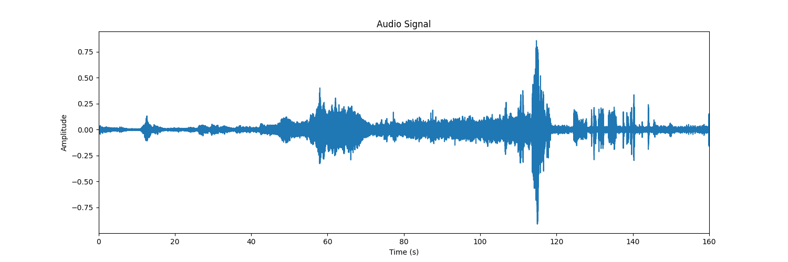

Audio Signal Analysis

A Python script to load, analyze, and visualize WAV audio files by plotting their waveform.

🚀 Quickstart

Clone repo

git clone [https://github.com/your-username/audio-analysis.git](https://github.com/Amir-Hossein-shamsi/Audio-Signal-Analysis)
cd audio-analysis

Install dependencies

pip install numpy matplotlib

Add WAV file
Place your .wav in assets/.

Run

python analyze_audio.py

🔧 Usage

Prints audio duration.

Displays and saves waveform plot as test.png.

🗂️ Files

assets/               # WAV files
analyze_audio.py      # Analysis script
test.png              # Output plot

📊 Waveform Plot

⚙️ Customize

Change input path in wave.open().

Adjust plot settings in Matplotlib.

Rename output in plt.savefig().

📄 License

MIT

